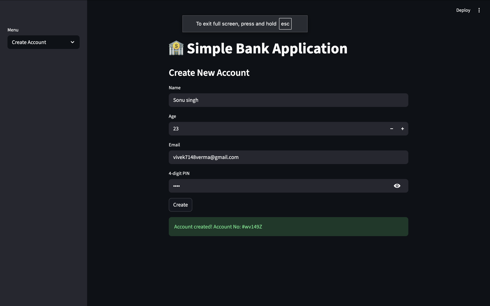
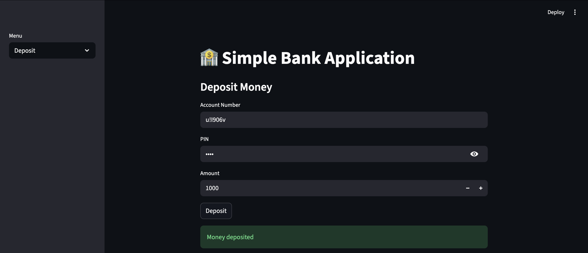

# Bank Management Streamlit App

A simple Bank Management System built using Python and Streamlit that allows users to manage accounts, deposits, withdrawals, and view transaction details through an interactive web interface. :contentReference[oaicite:0]{index=0}

---

## 🚀 Live Demo


---

## 🖼️ Screenshots

### 📌 App Home  


### 📌 Deposit / Withdraw  


---

## 💡 Features

✔ Create new bank accounts  
✔ View account details  
✔ Deposit money  
✔ Withdraw money  
✔ Transaction history

---

## 🛠️ Tech Stack

- Python  
- Streamlit

---

## 📥 How to Run Locally

1. Clone this repo  
   ```git clone https://github.com/vivekcode12345/bank-management-streamlit.git```
2. Change directory
   ```cd bank-management-streamlit```
3. Create Virtual Env
   ```python3 -m venv .venv```
   source .venv/bin/activate
4. Install requirements
   ```pip install streamlit```
5. Run App
   ```streamlit run app.py```

📄 License

This project is MIT Licensed.
   
   
   


